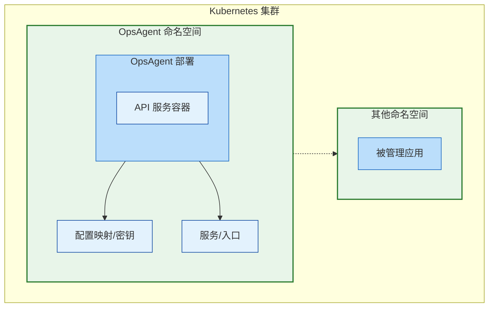
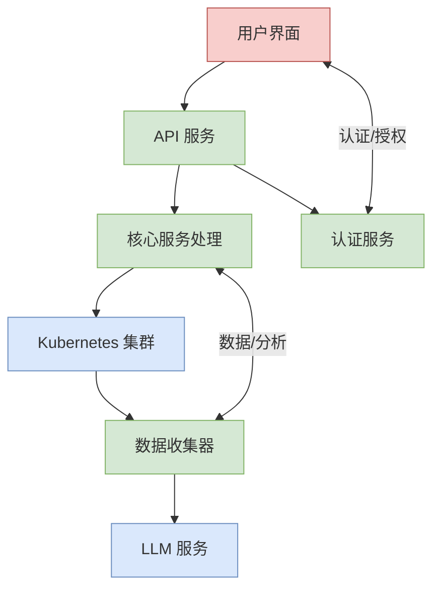

# OpsAgent 系统详细设计文档

## 1. 项目概述

### 1.1 背景介绍

OpsAgent 是一个基于大语言模型(LLM)的 Kubernetes 智能运维平台，旨在简化和优化 Kubernetes 集群的日常运维管理工作。该平台利用人工智能技术辅助运维人员进行集群监控、问题诊断、资源优化以及自动化运维任务。

### 1.2 设计目标

- 提供直观的 Kubernetes 集群管理界面
- 利用 LLM 实现智能化问题诊断和解决方案推荐
- 支持自动化运维任务执行和调度
- 实现集群资源使用的智能分析和优化建议
- 确保系统的安全性、可靠性和可扩展性

### 1.3 核心功能

- Kubernetes 资源监控与管理
- 基于 LLM 的智能分析和建议
- 自动化运维脚本执行
- 权限管理和安全审计
- 系统性能监控与报警

## 2. 系统架构

### 2.1 整体架构图

```mermaid
flowchart TB
    subgraph 整体["OpsAgent 系统架构"]
        subgraph Frontend["Web 前端层"]
            UI["用户界面"]
            Components["交互组件"]
            Visualization["数据可视化"]
        end
        
        subgraph APILayer["API 服务层"]
            RESTfulAPI["RESTful API"]
            AuthZ["认证授权"]
            Logic["业务逻辑"]
        end
        
        subgraph Integration["集成服务层"]
            K8sAPI["Kubernetes API"]
            LLMAPI["LLM 服务集成"]
            MonitoringAPI["监控系统集成"]
        end
        
        subgraph Core["核心服务层"]
            ResourceManager["资源管理器"]
            DiagnosisEngine["智能诊断引擎"]
            AutomationExecutor["自动化执行器"]
        end
        
        subgraph Data["数据持久层"]
            StateStorage["状态存储"]
            LogStorage["日志存储"]
            ConfigStorage["配置存储"]
        end
        
        subgraph Runtime["部署与运行时"]
            ContainerImages["容器镜像"]
            K8s["Kubernetes"]
            NetworkSecurity["网络与安全"]
        end
        
        Frontend <--> APILayer
        APILayer <--> Core
        APILayer <--> Integration
        Core <--> Integration
        Core <--> Data
        Integration <--> Runtime
        Core <--> Runtime
    end
    
    classDef layer fill:#f9f9f9,stroke:#333,stroke-width:2px
    classDef component fill:#e1f5fe,stroke:#01579b,stroke-width:1px
    
    class Frontend,APILayer,Integration,Core,Data,Runtime layer
    class UI,Components,Visualization,RESTfulAPI,AuthZ,Logic,K8sAPI,LLMAPI,MonitoringAPI,ResourceManager,DiagnosisEngine,AutomationExecutor,StateStorage,LogStorage,ConfigStorage,ContainerImages,K8s,NetworkSecurity component
```

### 2.2 逻辑架构

OpsAgent 采用多层架构设计，主要包括：

1. **表现层（前端）**：提供用户交互界面
2. **应用层（API服务）**：处理业务逻辑和请求
3. **核心服务层**：实现系统核心功能
4. **集成层**：与外部系统集成
5. **数据层**：负责数据存储和管理
6. **基础设施层**：提供运行环境支持

### 2.3 技术架构

- **后端**：Golang（框架：Gin）
- **前端**：（未明确指定，可能基于现代JS框架）
- **AI集成**：大型语言模型(LLM)
- **容器化**：Docker
- **编排**：Kubernetes
- **CI/CD**：（未明确指定）
- **监控**：Prometheus集成
- **数据处理**：Python脚本

## 3. 系统组件详解

### 3.1 核心组件

#### 3.1.1 API服务器

- **功能描述**：提供RESTful API接口，处理前端请求
- **技术实现**：基于Go语言的Gin框架
- **主要API**：
  - 用户认证与授权 `/api/login`
  - Kubernetes资源管理 `/api/resources/...`
  - 智能诊断与建议 `/api/ai/diagnosis`
  - 自动化任务执行 `/api/tasks/...`

#### 3.1.2 智能诊断引擎

- **功能描述**：基于LLM的智能分析和问题诊断
- **技术实现**：Go + Python集成
- **主要能力**：
  - 日志分析与异常检测
  - 性能问题识别
  - 资源优化建议
  - 最佳实践推荐

#### 3.1.3 Kubernetes集成模块

- **功能描述**：与Kubernetes API交互，管理集群资源
- **技术实现**：Go语言客户端库 + Python脚本
- **主要功能**：
  - 资源查询与监控
  - 配置管理
  - 操作执行
  - 状态跟踪

#### 3.1.4 自动化执行器

- **功能描述**：执行自动化运维脚本和任务
- **技术实现**：Go + Python + kubectl
- **主要功能**：
  - 脚本调度与执行
  - 结果收集与分析
  - 任务状态管理
  - 安全控制

### 3.2 辅助组件

#### 3.2.1 认证授权模块

- **功能描述**：管理用户身份验证和权限控制
- **技术实现**：JWT + RBAC
- **主要功能**：
  - 用户登录认证
  - 角色权限管理
  - 会话控制
  - 操作审计

#### 3.2.2 日志管理模块

- **功能描述**：系统日志收集、存储和分析
- **技术实现**：结构化日志 + 文件存储
- **主要功能**：
  - 日志记录
  - 日志查询
  - 日志分析
  - 日志轮转

#### 3.2.3 监控指标收集器

- **功能描述**：收集系统和集群的性能指标
- **技术实现**：Prometheus集成
- **主要功能**：
  - 性能指标采集
  - 资源使用监控
  - 指标暴露
  - 异常检测

## 4. 部署架构

### 4.1 容器化架构

OpsAgent 采用容器化部署方式，主要组件包括：

### 4.2 部署环境

OpsAgent 支持以下部署环境：

- **开发环境**：单副本部署，资源请求低，便于开发和测试
- **生产环境**：多副本高可用部署，带有资源限制和反亲和性调度

### 4.3 生产部署配置

生产环境部署关键配置：

- **副本数**：根据需求可配置多副本（默认1）
- **资源需求**：
  - 请求：CPU 500m，内存 512Mi
  - 限制：CPU 2000m，内存 2Gi
- **高可用策略**：
  - Pod 反亲和性调度
  - PodDisruptionBudget 确保可用性
  - 滚动更新策略
- **网络**：
  - Service 暴露内部服务
  - Ingress 提供外部访问，支持 TLS 和 IP 白名单
- **安全**：
  - ServiceAccount 与 RBAC 权限控制 
  - Secret 存储敏感信息
  - 容器以非 root 用户运行

## 5. 数据流与处理

### 5.1 主要数据流

### 5.2 数据处理流程

1. **用户请求流程**
   - 用户通过界面发起请求
   - 请求经认证授权后到达API服务
   - API服务调度相应核心服务处理
   - 核心服务与Kubernetes交互并返回结果
   - 结果返回至用户界面

2. **智能诊断流程**
   - 收集Kubernetes集群数据
   - 数据预处理和结构化
   - 将处理后数据发送给LLM服务
   - LLM分析数据并生成诊断结果
   - 结果经处理后呈现给用户

3. **自动化任务流程**
   - 用户配置自动化任务
   - 任务解析和验证
   - 任务调度和执行
   - 执行结果收集和分析
   - 结果通知和存储

### 5.3 数据存储

- **配置数据**：ConfigMap 和 Secret
- **系统日志**：持久化存储（可选）
- **运行状态**：内存和临时存储
- **用户数据**：取决于实际需求（当前版本可能不持久化）

## 6. 安全设计

### 6.1 身份认证与授权

- **认证机制**：基于JWT的令牌认证
- **授权策略**：基于RBAC的细粒度权限控制
- **会话管理**：令牌过期和刷新机制

### 6.2 数据安全

- **敏感数据保护**：
  - JWT密钥存储在Secret中
  - Kubeconfig安全存储
- **网络安全**：
  - TLS加密通信
  - Ingress IP白名单限制
- **容器安全**：
  - 非root用户运行
  - 只读文件系统（部分目录可写）
  - 最小权限原则

### 6.3 审计与合规

- **操作审计**：记录关键操作日志
- **异常检测**：监控异常访问和操作
- **合规性**：支持符合组织安全策略的配置

## 7. 性能设计

### 7.1 性能优化

- **资源分配**：根据负载调整资源请求和限制
- **缓存策略**：适当缓存频繁查询的数据
- **并发处理**：Go语言的并发特性处理多请求

### 7.2 可扩展性

- **水平扩展**：支持多副本部署
- **模块化设计**：核心功能模块化，便于扩展
- **API版本控制**：支持API演进

### 7.3 监控与告警

- **性能指标**：暴露Prometheus格式指标
- **健康检查**：提供readiness和liveness探针
- **资源监控**：监控系统资源使用情况

## 8. 开发与测试

### 8.1 开发环境

- **本地开发**：支持本地环境运行与调试
- **开发容器**：提供开发容器配置
- **配置管理**：环境变量和配置文件分离

### 8.2 测试策略

- **单元测试**：核心功能单元测试
- **集成测试**：组件间交互测试
- **端到端测试**：用户场景测试
- **性能测试**：负载和压力测试

### 8.3 CI/CD 集成

- **持续集成**：代码提交自动构建和测试
- **持续部署**：自动化部署流程
- **环境管理**：开发、测试、生产环境配置

## 9. 运维与管理

### 9.1 部署管理

- **部署脚本**：提供自动化部署脚本
- **配置管理**：配置文件模板和示例
- **版本控制**：镜像版本管理策略

### 9.2 日志与监控

- **日志收集**：结构化日志输出
- **监控集成**：Prometheus指标暴露
- **告警配置**：关键指标告警设置

### 9.3 故障恢复

- **备份策略**：配置备份建议
- **故障转移**：高可用部署支持
- **恢复流程**：故障恢复指南

## 10. 未来规划

### 10.1 功能增强

- **更强大的LLM集成**：提升诊断和分析能力
- **更多资源类型支持**：扩展可管理的资源类型
- **多集群管理**：支持管理多个Kubernetes集群

### 10.2 性能优化

- **更高效的数据收集**：优化数据收集和分析过程
- **更智能的缓存策略**：根据访问模式优化缓存

### 10.3 用户体验

- **更友好的UI**：优化用户界面和交互
- **更强的可视化**：增强数据可视化能力
- **个性化推荐**：基于用户角色和行为的个性化建议 