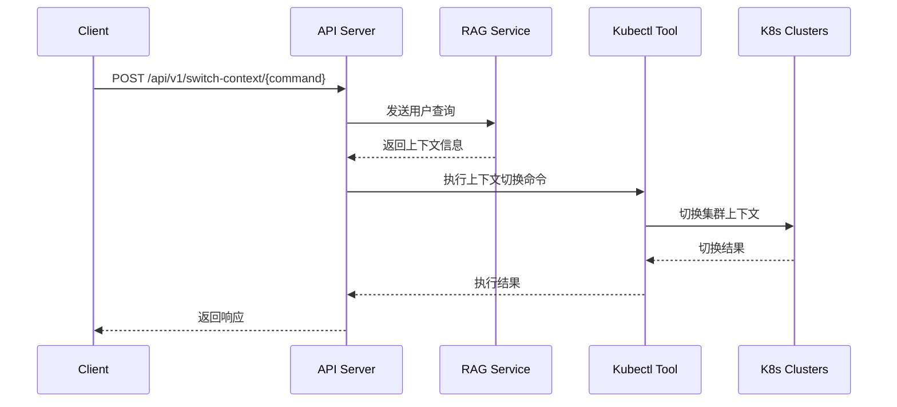

# RAG增强的Kubernetes上下文切换API设计文档

## 1. 功能概述

该API用于处理用户自然语言查询，通过RAG系统识别用户意图，自动切换Kubernetes上下文，并执行相应的查询操作。

## 2. 系统架构



## 3. API设计

### 3.1 接口规范

- 路径: `/api/v1/switch-context/{command}`
- 方法: POST
- 请求头: 
  - Content-Type: application/json
  - Authorization: Bearer {token}

### 3.2 请求参数

```json
{
    "query": "中国节点的account镜像版本是什么？",
    "parameters": {
        "rag_api_key": "YOUR_DASHSCOPE_API_KEY",
        "rag_app_id": "YOUR_APP_ID"
    }
}
```

### 3.3 RAG API响应格式

```json
{
  "output": {
    "finish_reason": "stop",
    "session_id": "73717313f1b64fb0a9d5acdffce56750",
    "text": "```json\n{\n  \"recommend\": \"kubectl config use-context ask-cn\"\n}\n```"
  },
  "usage": {
    "models": [
      {
        "output_tokens": 18,
        "model_id": "qwen-max-latest",
        "input_tokens": 1940
      }
    ]
  },
  "request_id": "e164e944-b2f8-95a8-961b-aee7d1f3b25f"
}
```

### 3.4 API响应格式

```json
{
    "code": 200,
    "message": "success",
    "data": {
        "context_switch": {
            "command": "kubectl config use-context ask-cn",
            "status": "success",
            "message": "Successfully switched to context ask-cn"
        },
        "query_result": {
            // 用户查询的执行结果
        }
    }
}
```

## 4. 错误处理

- 400: 请求参数错误
- 401: 未授权
- 403: 权限不足
- 500: 服务器内部错误

## 5. 实现步骤

1. 接收用户请求
2. 调用RAG API进行意图识别
3. 解析RAG返回的JSON格式文本（需要从text字段中提取JSON内容）
4. 从解析后的JSON中获取recommend字段的值
5. 执行kubectl命令切换上下文
6. 执行用户原始查询
7. 返回结果

## 6. 安全考虑

1. API认证和授权
2. RAG API密钥的安全存储
3. kubectl命令执行的安全控制
4. 输入验证和清理

## 7. 性能优化

1. 缓存RAG API的响应结果
2. 并发处理多个请求
3. 设置合理的超时时间

## 8. 监控和日志

1. 记录API调用日志
2. 监控上下文切换的成功率
3. 记录RAG API的响应时间
4. 错误追踪和告警 